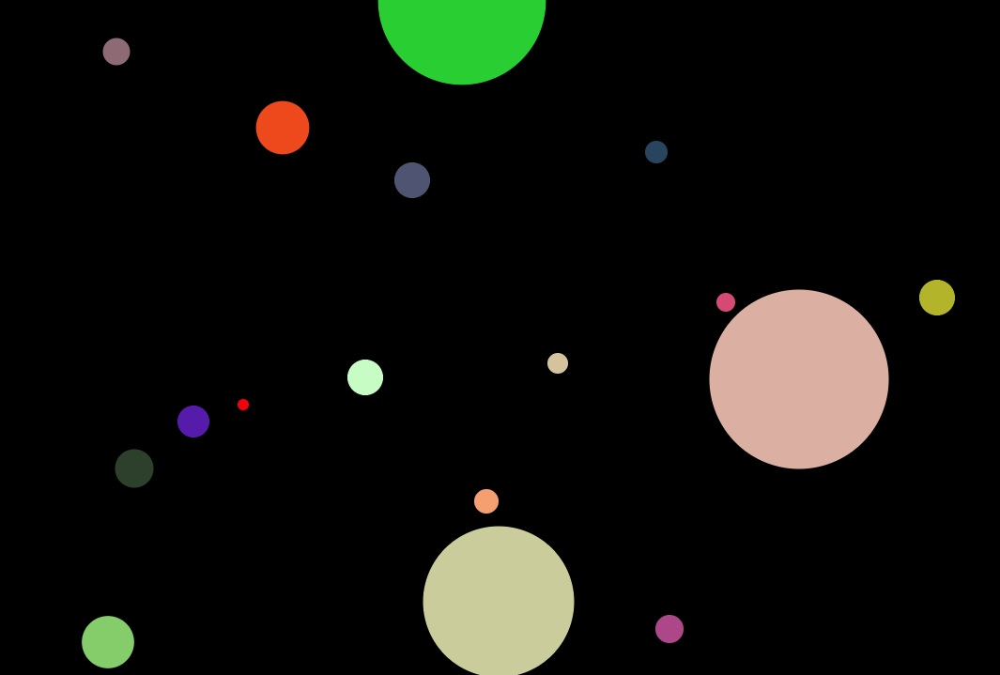

# FLYING BALLS

There is a lot of colorful flying balls all over the browser screen designed with canvas HTML5 and Javascript. Screen borders keep all balls from flying off the screen. Any larger ball can absorb a smaller ball and thereby increase in size. Having reached a critical size, each ball bursts and a new baby ball appears in its place.